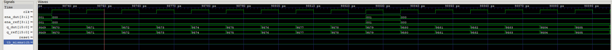

# Icarus Verilog HDL Skills

基于 [Icarus Verilog](http://iverilog.icarus.com/) 的 Verilog 仿真与调试工具包：**编译 → 仿真 → 三态裁决 → VCD 摘要 → TB/RTL 归因 → 波形可视化**。

## 仿真工作流

```text
RTL + Testbench
      │
      ▼
  sim.sh / sim.ps1          ← iverilog 编译 + vvp 仿真
      │
      ├── SIMULATION OK / FAILED / INCONCLUSIVE
      ├── VCD: <path>       ← 从 stdout 解析 dumpfile 路径
      │
      ▼
  vcd_peek.py               ← CLI 定点采样（指定时刻/信号）
      │
      ▼ (仅 FAIL 时)
  fail_triage.py            ← TB vs RTL 保守归因
      │
      ▼
  GTKWave（可选）            ← 交互式波形查看
```



*波形查看器中对比 DUT 输出（`q_dut`）与参考模型（`q_ref`），`tb_mismatch` 标记不一致时刻。*

## 目录结构

```text
skills/
├── README.md
├── assets/
│   └── sim-waveform.jpg
└── icarus-verilog/
    ├── SKILL.md            # Agent 工作流说明
    ├── reference.md        # 参数与裁决表
    ├── examples.md         # 验收用例
    └── scripts/
        ├── sim.sh / sim.ps1
        ├── run_flow.sh / run_flow.ps1
        ├── vcd_peek.py
        └── fail_triage.py
```

## 环境要求

| 工具 | 用途 |
|------|------|
| [Icarus Verilog](http://iverilog.icarus.com/) | `iverilog` 编译、`vvp` 仿真 |
| Python 3.10+ | `vcd_peek.py`、`fail_triage.py` |
| [GTKWave](http://gtkwave.sourceforge.net/) | 可选，交互式 VCD 波形查看 |

### 安装 Icarus Verilog

从 [Icarus 官网](http://iverilog.icarus.com/) 安装，确保 `iverilog`、`vvp` 在 PATH 中。

Windows 常见路径：`C:\iverilog\bin\iverilog.exe`

### 安装 GTKWave（可视化，可选）

- **Windows**：安装后将 `gtkwave.exe` 加入 PATH
- **Linux**：`sudo apt install gtkwave`
- **macOS**：`brew install gtkwave`

## 安装 Skill

将 `icarus-verilog` 目录复制到你的 Agent Skills 路径，例如：

```bash
cp -r skills/icarus-verilog ~/.claude/skills/
```

```powershell
Copy-Item -Recurse skills\icarus-verilog $env:USERPROFILE\.claude\skills\
```

## 快速开始

### 1. 编译 + 仿真

```powershell
powershell -File skills/icarus-verilog/scripts/sim.ps1 `
  -Rtl verilog/adder.v `
  -Testbench verilog/adder_tb.v `
  -WorkDir verilog/build `
  -OutName adder_tb
```

```bash
bash skills/icarus-verilog/scripts/sim.sh \
  verilog/adder.v verilog/adder_tb.v verilog/build "" adder_tb
```

期望输出：`ALL TESTS PASSED` → `SIMULATION OK`，以及 `VCD: ...` 行。

参数说明：

| 参数 | 含义 |
|------|------|
| `-Top` / 第 4  positional | 可选，`iverilog -s` 顶层模块名 |
| `-OutName` / 第 5 positional | `.vvp` 文件名（默认同 TB 文件名） |

### 2. CLI 波形摘要（定点采样）

```bash
python skills/icarus-verilog/scripts/vcd_peek.py \
  --vcd verilog/build/adder.vcd \
  --signals a,b,sum,carry \
  --times 10,20,30
```

只查看 **指定时刻** 的信号值；不会因「全程出现过 X」而误判。

### 3. GTKWave 可视化

仿真成功后，用 log 中的 `VCD:` 路径打开波形：

```bash
gtkwave verilog/build/adder.vcd
```

```powershell
gtkwave verilog\build\adder.vcd
```

**常用操作：**

| 操作 | 说明 |
|------|------|
| 左侧 SST 面板 | 展开层次 → 选中信号 → **Insert** 加入波形区 |
| 缩放 | `Ctrl` + 滚轮，或工具栏 **Zoom Fit** |
| 光标 | 点击波形区，底部/status 栏显示该时刻各信号值 |
| 对比 DUT / TB | 同时加入顶层 `sum` 与 `uut.sum` |
| 标记 FAIL 时刻 | 根据 FAIL 行 `@time` 移动光标到对应时刻 |
| 保存配置 | **File → Write Save File** 存 `.gtkw`，下次 **Read Save File** 直接恢复 |

### 4. 一键流程（仿真 + peek + triage）

```powershell
powershell -File skills/icarus-verilog/scripts/run_flow.ps1 `
  -Rtl verilog/adder.v `
  -Testbench verilog/adder_tb.v `
  -WorkDir verilog/build `
  -OutName adder_tb `
  -Signals "a,b,sum,carry" `
  -Times "10,30"
```

```bash
bash skills/icarus-verilog/scripts/run_flow.sh \
  verilog/adder.v verilog/adder_tb.v verilog/build "" adder_tb \
  "a,b,sum,carry" "10,30" auto
```

仿真 FAIL 时自动运行 `fail_triage.py`。

## 仿真裁决（三态）

| 输出 | exit | 含义 |
|------|------|------|
| `SIMULATION OK` | 0 | TB 自检全部通过 |
| `SIMULATION FAILED (functional)` | 1 | TB 报告 FAIL |
| `SIMULATION INCONCLUSIVE (no verdict)` | 2 | 无裁决字符串，需人工查看 |

## TB vs RTL 归因

`fail_triage.py` 以 **FAIL 行（check 采样时刻）** 为权威来源；VCD 仅在输入 `a,b` 对齐时用于连线检查。

| `--model` | 说明 |
|-----------|------|
| `auto` | 保守：仅 FAIL 行含 `cin` 时用 fadd |
| `adder` / `fadd` | 显式指定参考模型 |
| `none` | 仅连线检查，不做 spec 归因 |

详见 [icarus-verilog/SKILL.md](icarus-verilog/SKILL.md)、[reference.md](icarus-verilog/reference.md)、[examples.md](icarus-verilog/examples.md)。

## 示例工程布局

```text
verilog/
├── adder.v          # RTL
├── adder_tb.v       # Testbench（check + ALL TESTS PASSED / FAILED）
└── build/           # 仿真产物（建议 gitignore）
    ├── adder_tb.vvp
    └── adder.vcd
```

扁平布局（如 `verilog/adder.v`）同样支持，脚本中写明确路径即可。

## 推送到 GitHub

### 首次初始化（独立 Skill 仓库）

若要将本目录作为独立仓库发布：

```powershell
# 在仓库根目录或 skills/ 上级目录操作
cd D:\code\pico_copy

git init
git add skills/README.md skills/assets/ skills/icarus-verilog/ verilog/adder.v verilog/adder_tb.v .gitignore
git commit -m "docs: add Icarus Verilog HDL skills with waveform guide"

# 在 GitHub 网页 Create repository（不要勾选 Initialize with README）
git branch -M main
git remote add origin https://github.com/YOUR_USER/icarus-verilog-skills.git
git push -u origin main
```

推送后访问 `https://github.com/YOUR_USER/icarus-verilog-skills`，README 与波形图会显示在仓库首页。

### 已有远程仓库

```powershell
git add skills/README.md skills/assets/sim-waveform.jpg skills/icarus-verilog/
git commit -m "docs: update skills README with visualization guide"
git push origin main
```

### GitHub Pages（可选）

1. 仓库 **Settings → Pages**
2. **Source**：Deploy from branch → `main` → `/docs` 或 `/root`
3. 若用 `/docs`：将 README 复制为 `docs/index.md`，图片放 `docs/assets/sim-waveform.jpg`

站点地址：`https://YOUR_USER.github.io/REPO_NAME/`

### 推送前检查

- 图片使用 `assets/sim-waveform.jpg`（避免中文文件名）
- 不要提交 `*.vvp`、`*.vcd` 等仿真产物
- 发布时只保留 `icarus-verilog/`（勿包含旧版 `icverilog/` 副本）

## 更多文档

| 文件 | 内容 |
|------|------|
| [SKILL.md](icarus-verilog/SKILL.md) | 完整 Agent 工作流 |
| [reference.md](icarus-verilog/reference.md) | 参数、X/采样规则 |
| [examples.md](icarus-verilog/examples.md) | 验收用例 F / G / H |
